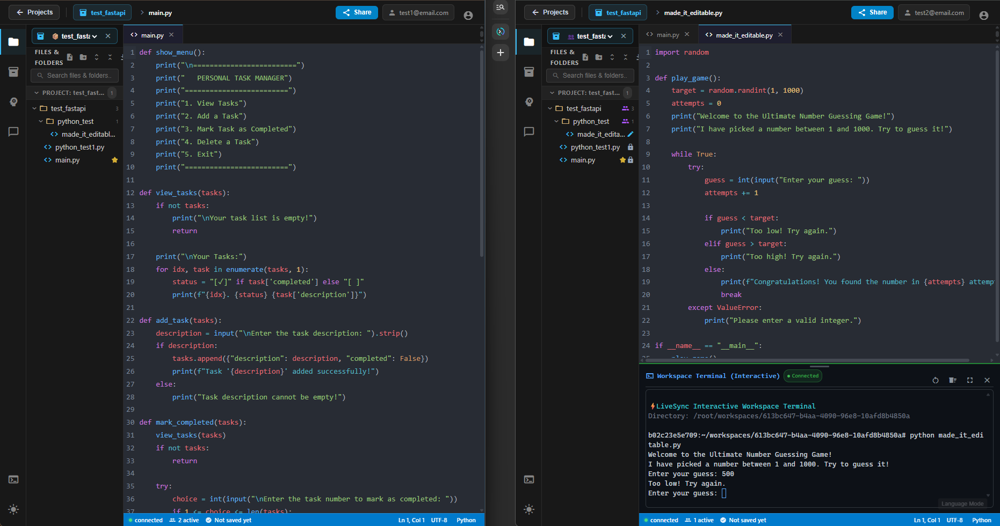

# ⚡ LiveSync

> **Enterprise Real-Time Collaborative Code Editor, Go API Gateway, Python AI Intelligence & Interactive Live Terminal**

<p align="center">
  
</p>

LiveSync is a high-performance, real-time collaborative code editor built on a decoupled polyglot microservices architecture. It combines Google Docs-style real-time collaboration with a high-throughput Go API Gateway & native PTY terminal engine, Python AI code intelligence & Big-O complexity analysis, and hybrid AI assistance (Local LLM / Cloud Gemini).

---

## 🚀 Key Capabilities

- **🤝 Real-Time Collaboration & $TP_1$ Conflict Resolution**: Mathematically proven Operational Transformation (OT) and CRDT deterministic tie-breaking engine guaranteeing Transformation Property 1 ($TP_1$) convergence across concurrent multi-user typing sessions without lock contention.
- **⚡ Sub-Millisecond Event-Driven Persistence**: Keystroke operations update in-memory Redis sorted sets in $< 2\text{ms}$; snapshots are asynchronously streamed via Redis Streams (`livesync:stream:document-saves`) to PostgreSQL in batches without blocking collaborative socket loops.
- **🛡️ Storage Quotas & Dependency Isolation**: Multi-tier dependency shields prevent `node_modules`, `venv`, and binaries from touching persistent storage, with strict project resource caps (30 files, 256 KB/file, 2 MB project limit).
- **⚡ Go API Gateway (`livesync-gateway`)**: High-throughput gateway handling JWT validation, CORS, PTY shell allocation (`powershell.exe`/`/bin/bash`), direct PyPI/npm package search, HTTP/2 gRPC client connection pooling, and backend-authoritative project compilation.
- **🤖 Python AI & AST Intelligence (`livesync-ai`)**: Dedicated worker serving requests over native gRPC (`port 50051`) for AST Big-O complexity analysis ($\mathcal{O}(N)$, $\mathcal{O}(N^2)$), unit test generation, refactoring, and hybrid local/cloud LLM intelligence.
- **📺 True Interactive Workspace Terminal & Streaming**: Real-time bi-directional `xterm.js` terminal canvas connected via WebSockets to a native PTY shell (`powershell.exe`/`/bin/bash`) anchored in the project workspace with OS read-only protection for locked files.
- **📊 AST Big-O Complexity Analyzer**: Static AST code analysis computing Time ($\mathcal{O}(N)$, $\mathcal{O}(N^2)$) and Space complexity.
- **🤖 Hybrid AI Assistance**: Local OpenAI-compatible LLM (`llama-server` / `Qwen2.5-Coder`) & Google Gemini with zero-cost offline AST structural analysis fallback.
- **⚡ Event-Driven Persistence**: Realtime service appends saves to Redis Streams (`livesync:stream:document-saves`); Go API (`livesync-api`) consumes and persists to PostgreSQL.

---

## 🏗️ System Architecture

```
                                  ┌────────────────────────────────────────┐
                                  │           Angular 22 UI Client         │
                                  │   (CodeMirror 6 + xterm.js + Material) │
                                  └───────────────────┬────────────────────┘
                                                      │
                                              Nginx Edge Proxy (5038)
                                                      │
         ┌───────────────────────────────┬────────────┴──────────────────┬───────────────────────────────┐
         │ (HTTP REST / Auth)            │ (WebSockets / Room Sync)      │ (HTTP REST & WS Streams)      │
         ▼                               ▼                               ▼                               ▼
┌──────────────────┐           ┌──────────────────┐           ┌──────────────────┐            ┌──────────────────┐
│   livesync-api   │           │ livesync-realtime│           │ livesync-gateway │            │ local llama.cpp  │
│ (Go 1.26 REST)   │           │(Node.js/Socket.IO│           │ (Go API Gateway) │            │ (OpenAI Compat)  │
└────────┬─────────┘           └────────┬─────────┘           └────────┬─────────┘            └────────┬─────────┘
         │                              │                              │                               ▲
         │ (XREADGROUP)                 │ (XADD Event Stream)          │ gRPC (HTTP/2 Port 50051)      │
         ▼                              ▼                              ▼                               │
┌──────────────────────────────────────────────────┐          ┌──────────────────┐                     │
│                Redis 7 (AOF)                     │          │   livesync-ai    │─────────────────────┘
│         (Streams & Socket.IO Bus)                │          │  (Python gRPC)   │
└──────────────────────────────────────────────────┘          └──────────────────┘
```

### Microservice Registry

| Service | Technology | Role | Port |
| :--- | :--- | :--- | :--- |
| **`livesync-ui`** | Angular 22, CodeMirror 6, xterm.js | Single-page reactive editor & terminal | `4200` (Dev) / `4000` (Prod) |
| **`livesync-gateway`** | Go 1.26, PTY, gRPC client | Zero-trust API Gateway, live PTY shell, JWT authorization, package search | `8081` |
| **`livesync-ai`** | Python 3.14, Native gRPC | AI Pair Assistant, AST Big-O analyzer, LLM proxy | `50051` (gRPC) |
| **`livesync-api`** | Go 1.26, Chi, pgxpool | Auth, user sessions, document/folder CRUD, Redis Stream consumer | `8080` (Internal) |
| **`livesync-realtime`** | Node.js 24, Socket.IO 4.8 | CRDT room broadcasting, cursor sync & Redis Stream publisher | `5000` |
| **`api-loadbalancer`** | Nginx Alpine | Reverse proxy & API Gateway Router | `5038` |
| **`postgres`** | PostgreSQL 17-alpine | Primary relational metadata database | `5432` |
| **`redis`** | Redis 7-alpine | Event streams log & Socket.IO pub/sub bus | `6379` |

---

## 🛠️ Quick Start

### 1. Running the Full Stack with Docker Compose

```powershell
# Build and launch all microservices in the background
docker compose up --build -d

# View service logs
docker compose logs -f
```

Access the UI at `http://localhost:4000` (or `http://localhost:5038` via Nginx edge proxy).

---

### 2. Running Microservices Locally for Development

If you prefer running databases in Docker and services locally on your host:

#### Step 1: Start PostgreSQL & Redis
```powershell
docker compose up -d postgres redis
```

#### Step 2: Launch the Services

* **Go Core API (`livesync-api`)**:
  ```powershell
  cd livesync-api
  go run main.go
  ```

* **Python AI Service (`livesync-ai`)**:
  ```powershell
  cd livesync-ai
  .\venv\Scripts\python -m app.main
  ```

* **Go API Gateway (`livesync-gateway`)**:
  ```powershell
  cd livesync-gateway
  go run main.go
  ```

* **Node.js Realtime Server (`livesync-realtime`)**:
  ```powershell
  cd livesync-realtime
  npm run dev
  ```

* **Angular Frontend (`livesync-ui`)**:
  ```powershell
  cd livesync-ui
  npm start
  ```

---

## 📁 Repository Layout

```
LiveSync/
├── proto/               # Protobuf contracts (ai.proto)
├── livesync-gateway/    # Go API Gateway, PTY Terminal Engine & Direct Package Search
├── livesync-ai/         # Python AI Intelligence, Native gRPC Worker & AST Analyzer
├── livesync-api/        # Go 1.26 REST API, PostgreSQL & Redis Stream Consumer
├── livesync-realtime/   # Node.js 24 + Socket.IO Realtime Collaboration Service
├── livesync-ui/         # Angular 22 CodeMirror & xterm.js Workspace App
├── livesync-infra/      # Nginx proxy configuration
├── docs/                # Comprehensive technical documentation
└── docker-compose.yml   # Multi-container orchestration specification
```

---

## 📚 Technical Documentation

Comprehensive architectural specifications and roadmap trackers are located in the [`docs/`](./docs/ARCHITECTURE.md) folder:

- **[Architecture & Technical Specifications (`docs/ARCHITECTURE.md`)](./docs/ARCHITECTURE.md)**: System topography, polyglot rationale, formal OT/CRDT conflict resolution proofs ($TP_1$), service deep-dives, and competitive benchmark matrix.
- **[Project Roadmap & Test Verification Matrix (`docs/PROJECT_ROADMAP.md`)](./docs/PROJECT_ROADMAP.md)**: Milestones, completed features, active backlog, and full polyglot test verification guide.

---

## 📜 License

Distributed under the MIT License. See `LICENSE` for more information.
