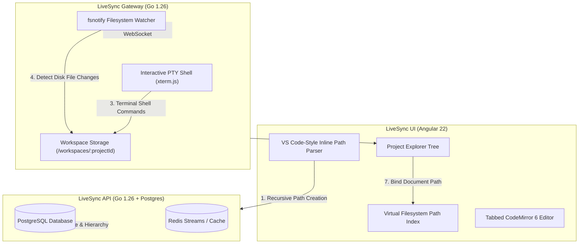

# System Architecture & Service Topography

LiveSync utilizes a decoupled, high-performance polyglot microservices architecture where client requests pass through an Nginx edge proxy or Go API Gateway, routed to specialized backend microservices communicating via HTTP/2 gRPC, Redis Streams, and WebSockets.

---

## 🏗️ High-Level Service Architecture

```
                                  ┌────────────────────────────────────────┐
                                  │           Angular 22 UI Client         │
                                  │   (CodeMirror 6 + xterm.js + Material) │
                                  └───────────────────┬────────────────────┘
                                                      │
                                              Nginx Edge Proxy (5038)
                                                      │
         ┌───────────────────────────────┬────────────┴──────────────────┬───────────────────────────────┐
         │ (HTTP REST / Auth)            │ (WebSockets / Room Sync)      │ (HTTP REST & WS Streams)      │
         ▼                               ▼                               ▼                               ▼
┌──────────────────┐           ┌──────────────────┐           ┌──────────────────┐            ┌──────────────────┐
│   livesync-api   │           │ livesync-realtime│           │ livesync-gateway │            │ local llama.cpp  │
│ (Go 1.26 REST)   │           │(Node.js/Socket.IO│           │ (Go API Gateway) │            │ (OpenAI Compat)  │
└────────┬─────────┘           └────────┬─────────┘           └────────┬─────────┘            └────────┬─────────┘
         │                              │                              │                               ▲
         │ (XREADGROUP)                 │ (XADD Event Stream)          │ gRPC (HTTP/2 Port 50051)      │
         ▼                              ▼                              ▼                               │
┌──────────────────────────────────────────────────┐          ┌──────────────────┐                     │
│                Redis 7 (AOF)                     │          │   livesync-ai    │─────────────────────┘
│         (Streams & Socket.IO Bus)                │          │  (Python gRPC)   │
└──────────────────────────────────────────────────┘          └──────────────────┘
```

---

## 📦 Microservices Breakdown

| Service Name | Primary Tech Stack | Purpose | Internal Transport | Exposed Port |
| :--- | :--- | :--- | :--- | :--- |
| **`livesync-gateway`** | Go 1.26, `creack/pty`, `coder/websocket`, `fsnotify` | API Gateway, Live PTY shell, JWT middleware, `fsnotify` terminal disk watcher, direct package search & gRPC client proxy | HTTP/1.1, WS, gRPC client | `8081` |
| **`livesync-ai`** | Python 3.14, Native gRPC, Pytest | AI Pair Assistant, AST Big-O complexity analyzer, LLM integration | gRPC (HTTP/2) | `50051` (gRPC) |
| **`livesync-api`** | Go 1.26, `chi`, `pgxpool`, PostgreSQL 17-alpine | Metadata, user authentication, document storage & Redis Stream consumer | REST / SQL | `8080` (Direct) / `5038` (Nginx) |
| **`livesync-realtime`** | Node.js 24, Socket.IO 4.8 | Low-latency room broadcasting, CRDT collaboration & Redis Stream publisher | WebSockets / Redis | `5000` |
| **`livesync-ui`** | Angular 22, CodeMirror 6, xterm.js | Single-page application code editor, VFS indexer, and terminal canvas | HTTP | `4200` (Dev) / `4000` (Prod) |
| **`api-loadbalancer`**| Nginx Alpine | Reverse proxy, path-based routing & SSL termination | HTTP / WS | `5038` |
| **`postgres`** | PostgreSQL 17-alpine | Relational document store, user accounts, and folder trees | TCP / SQL | `5432` |
| **`redis`** | Redis 7-alpine | Event streams (`livesync:stream:document-saves`) & Socket.IO pub/sub adapter | TCP / Redis | `6379` |

---

## 📁 Virtual Filesystem (VFS) & Terminal Bi-Directional Disk Sync

LiveSync bridges browser-based PostgreSQL storage with native server-side disk execution using a dual-layer Virtual Filesystem (VFS) and real-time disk watching:



1. **Virtual Filesystem (VFS) Mapping**:
   - Maintains bidirectional index: `pathToDocId: Map<string, string>` (e.g. `src/utils/math.ts -> uuid-1`) and `docIdToPath: Map<string, string>`.
   - Resolves relative imports (`import { add } from '../utils/math'`) to canonical document IDs for cross-file autocomplete and AI context.
2. **Bi-Directional `fsnotify` Disk Watcher**:
   - Go Gateway recursively monitors the workspace directory on disk (`./workspaces/{projectId}`) during active terminal sessions.
   - Pushes `fs_change` JSON frames over the WebSocket on terminal commands (`mkdir`, `touch`, `npm create vite`, `git clone`), automatically triggering UI explorer tree reload.

---

## ⚡ Inter-Service Communication Protocol

### 1. Client to Go Gateway (`livesync-gateway`) & Zero-Trust Authentication
- All Gateway endpoints enforce cryptographic JWT validation (`HS256`), issuer & audience verification, and caller identity extraction (`UserClaims`).
- `POST /api/workspaces/:id/sync` -> Verified atomic disk workspace synchronization decoupled from terminal streams with transient SHA-256 hash `fsnotify` suppression (requires active `Edit` workspace permission).
- `GET /api/workspaces/:id/sync` -> Retrieves workspace disk file manifest and content hashes (requires active `View`/`Edit` workspace permission).
- `GET /api/workspaces/:id/search` -> High-speed workspace-wide regex/whole-word multi-file search (requires `View`/`Edit` permission).
- `POST /api/workspaces/:id/replace` -> Atomic multi-file and single-match replace (requires `Edit` permission).
- `WS /api/terminal/ws?projectId=...` -> Interactive workspace PTY shell session streaming (`powershell.exe` on Windows / `/bin/bash` in Docker) anchored in `./workspaces/{projectId}` with active `fsnotify` disk watching and permission evaluation.
- `GET /api/execution/languages` -> Fetches supported polyglot execution runtimes.
- `POST /api/ai/analyze` -> Triggers AI code analysis (Explain, Refactor, Unit Tests, Suggest, Big-O Complexity).
- `GET /api/ai/models` -> Returns active local and cloud LLM models.
- `GET /api/packages/?query=...&language=...` -> Direct high-performance PyPI / npm package search.

### 2. Go Gateway to Python AI Service (`livesync-ai`)
- Communicates exclusively over **HTTP/2 gRPC on port 50051** via `proto/ai.proto`.
- Python AI service runs completely isolated behind the Go Gateway with zero public HTTP route exposure.

### 3. Realtime to Database Persistence (Write-Behind & Monotonic Read Cache)
- `livesync-realtime` receives document operations, updates in-memory CRDT / Redis cache (`livesync:doc:{id}:content`), periodically takes snapshot checkpoints & compacts operation logs, and appends snapshots to Redis Stream `livesync:stream:document-saves`.
- `livesync-api` reads from the Redis Stream via `XREADGROUP` (group: `api-save-group`) and asynchronously flushes document content snapshots into PostgreSQL.
- `livesync-api` inspects the active Redis document snapshot cache on `GET /api/documents/{id}` before falling back to PostgreSQL, guaranteeing monotonic read consistency.
- Periodic and on-disconnect flushers ensure zero data loss during server restarts or room closures.
