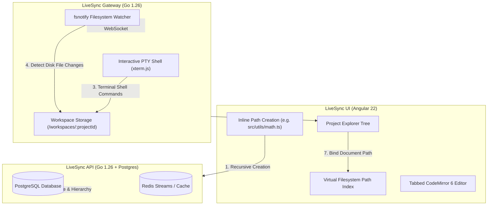

# 📁 Virtual Filesystem (VFS) & Terminal Bi-Directional Disk Synchronization

> **Architecture & Implementation Specification**
> **Scope**: `livesync-ui`, `livesync-gateway`, `livesync-api`
> **Status**: 🔄 In Progress

---

## 📌 Executive Summary

LiveSync provides real-time collaborative editing on PostgreSQL/Redis storage while offering a live PTY terminal running on server disk. To eliminate friction and ensure data consistency, the file and folder system is upgraded across four key pillars:
1. **VS Code-Style Inline Tree Creation & Path Parser**: Direct inline input in the explorer supporting nested paths (e.g., `src/components/Button.tsx`).
2. **Bi-Directional Terminal Disk Watcher**: Automatic real-time reflection of terminal disk changes (`git clone`, `npm create vite`, `touch`) into the UI file explorer.
3. **Path-Aware Virtual Filesystem (VFS) Index**: Fast mapping between virtual relative paths (`/src/utils/math.ts`) and document UUIDs for cross-file imports and AI intelligence.
4. **Bulk Directory Drag-and-Drop & ZIP Export**: Direct upload of local project folders and 1-click ZIP bundle downloads.

---

## 🏗️ Architecture & Data Flow

---

## 🚀 Detailed Phase Breakdown

### Phase 1: VS Code-Style Inline Tree Creation with Nested Path Parsing (`FEAT-03`)
* **Objective**: Remove disruptive modal popups when creating files or folders.
* **Key Capabilities**:
  - **Inline Input Row**: Clicking `+ New File` or `+ New Folder` mounts an active `<input>` row directly under the active project or parent folder.
  - **Multi-Level Path Resolution**: Typing `src/components/ui/Button.tsx` recursively checks and creates `src/`, `components/`, `ui/` folders if they don't exist, places `Button.tsx` in `ui/`, expands the tree, and immediately opens the file in a new tab.
  - **Keyboard Workflow**: Press `Enter` to commit, `Escape` to cancel.
  - **Inline Renaming**: Double-click or context-menu rename switches node title to inline edit mode.

### Phase 2: Bi-Directional Terminal Disk Watcher (`FEAT-04`)
* **Objective**: Automatically synchronize files created, modified, or deleted by terminal commands with PostgreSQL and the UI explorer.
* **Key Capabilities**:
  - **Go `fsnotify` Integration**: Gateway watches the project directory on disk (`./workspaces/{projectId}`).
  - **Debounced Change Ingestion**: Filters temporary files (e.g. `.git/`, `.cache/`, `node_modules/`) and pushes delta changes over the existing WebSocket connection.
  - **Dual-Way Persistence**: When a file is created on disk via bash (`touch config.json`), Gateway notifies the API to register the document and streams the update to the UI.

### Phase 3: Path-Aware Virtual Filesystem (VFS) Indexer (`FEAT-05`)
* **Objective**: Enable relative import resolution (`import { foo } from './utils/math'`) and whole-project AI analysis.
* **Key Capabilities**:
  - **Path-to-ID Indexing**: Maintains an in-memory Trie/Hash of `relativePath -> documentId` (e.g., `src/index.ts -> UUID-1`).
  - **AI Context Ingestion**: Python AI assistant receives the full project file map to resolve cross-file dependencies when analyzing code.

### Phase 4: Bulk Operations & ZIP Export (`FEAT-06`)
* **Objective**: Seamless onboarding and exporting of full codebases.
* **Key Capabilities**:
  - **Directory Drag-and-Drop**: Drop a directory from the local OS into the browser; WebKit directory reader parses the tree and batch creates folders and documents.
  - **1-Click ZIP Download**: Generates a clean project archive preserving the folder structure.

---

## 📊 Implementation Tracker

| Feature ID | Feature Description | Scope | Status |
|:---|:---|:---|:---|
| **FEAT-03** | Inline File/Folder Creation with Deep Path Parsing | `livesync-ui` | 🔄 In Progress |
| **FEAT-04** | Bi-directional `fsnotify` Terminal Disk Watcher | `livesync-gateway`, `livesync-api` | ⏳ Pending |
| **FEAT-05** | Path-Aware Virtual Filesystem (VFS) Index | `livesync-ui`, `livesync-ai` | ⏳ Pending |
| **FEAT-06** | Folder Drag & Drop Upload + Project ZIP Export | `livesync-ui`, `livesync-api` | ⏳ Pending |
